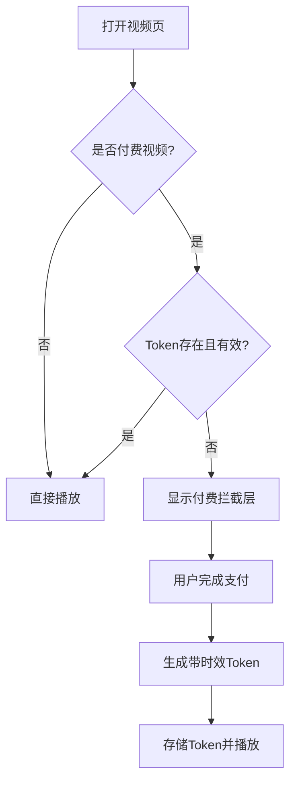
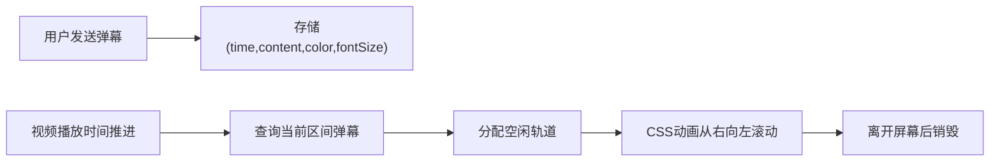

## 1. 产品概述

CloudStream 是一个现代化视频点播平台，支持用户上传视频、自动转码为多分辨率HLS流、实时弹幕互动、付费观看鉴权等完整视频消费体验。面向内容创作者和视频观看用户，提供高可用、低延迟的视频服务。

## 2. 核心功能

### 2.1 用户角色

| 角色 | 注册方式 | 核心权限 |
|------|---------|---------|
| 普通用户 | 邮箱/用户名注册 | 浏览视频、上传视频、发送弹幕、记录播放进度、购买付费视频 |
| 访客 | 无需注册 | 浏览公开视频列表，不可上传/发送弹幕/购买 |

### 2.2 功能模块

1. **首页**：视频瀑布流列表、分类导航、搜索框、热门推荐
2. **上传页面**：视频文件上传、标题/描述/分类设置、付费选项、转码进度实时展示
3. **视频播放页**：HLS视频播放器、自适应清晰度切换、倍速播放、进度拖拽、断点续播
4. **弹幕系统**：时间点弹幕发送、多轨道渲染、弹幕开关、字号调节
5. **付费鉴权**：视频付费设置、支付流程、带时效的播放Token生成与验证

### 2.3 页面详情

| 页面名称 | 模块名称 | 功能描述 |
|---------|---------|---------|
| 首页 | 顶部导航栏 | Logo、分类菜单、搜索框、上传按钮、用户头像/登录入口 |
| 首页 | Hero推荐区 | 轮播展示精选视频，点击跳转播放页 |
| 首页 | 视频网格 | 瀑布流视频卡片列表，支持分类筛选和排序 |
| 首页 | 视频卡片 | 封面缩略图、标题、作者、时长、观看数、付费标识 |
| 上传页面 | 上传表单 | 拖拽上传、文件选择、标题输入、描述编辑、分类选择 |
| 上传页面 | 付费设置 | 开关切换付费模式、价格输入、预览设置 |
| 上传页面 | 转码进度 | 实时进度条、当前转码阶段、分辨率完成状态、WebSocket推送 |
| 视频播放页 | 播放器容器 | HLS视频播放、加载状态、错误提示 |
| 视频播放页 | 控制栏 | 播放/暂停、进度条拖拽、音量、全屏、倍速选择、清晰度切换 |
| 视频播放页 | 弹幕层 | 多轨道滚动弹幕、发送输入框、弹幕设置面板 |
| 视频播放页 | 视频信息 | 标题、作者、描述、标签、观看数、点赞数 |
| 视频播放页 | 付费拦截 | 付费视频预览时长限制、支付弹窗、购买按钮 |

## 3. 核心流程

### 3.1 视频上传转码流程

用户选择视频文件并填写元数据，上传成功后系统创建转码任务并推入队列。Worker异步处理转码，将原视频转换为360P/720P/1080P多分辨率HLS切片。转码进度通过WebSocket实时推送到上传页面，完成后更新视频状态为可播放。

### 3.2 播放鉴权流程

用户打开付费视频时，前端检查是否存在有效Token。无Token或Token过期则拦截播放，引导支付。支付成功后后端生成带时效的JWT Token，前端携带Token请求M3U8播放地址。

### 3.3 弹幕渲染流程

用户发送弹幕时携带时间戳信息。播放过程中，播放器按当前时间查询该时间点附近的弹幕，分配到不同轨道避免重叠，以固定速度从右向左滚动渲染。

## 4. 用户界面设计

### 4.1 设计风格

- **主色调**：深邃紫蓝渐变 (#6366F1 → #8B5CF6)，营造流媒体科技感
- **辅助色**：霓虹粉色 (#EC4899) 用于强调按钮和互动元素
- **背景**：深色主题 (#0F0F1A)，搭配微弱的渐变光晕，避免纯白刺眼
- **按钮风格**：圆角12px，主按钮带渐变填充和微发光hover效果
- **字体**：标题使用 "Space Grotesk" 现代几何无衬线字体，正文使用 "Inter" 保证可读性
- **布局风格**：卡片式布局，视频卡片带圆角遮罩和悬浮上浮效果
- **图标**：Lucide图标库，线性风格，统一24px基础尺寸

### 4.2 页面设计概述

| 页面名称 | 模块名称 | UI元素 |
|---------|---------|--------|
| 首页 | 导航栏 | 半透明毛玻璃背景、Logo渐变文字、搜索框带发光聚焦效果 |
| 首页 | Hero推荐 | 大图渐变遮罩、标题浮层、自动轮播指示器、进度条动效 |
| 首页 | 视频卡片 | 16:9封面、时长徽章悬浮右下、悬停放大+阴影加深、付费标识角标 |
| 上传页面 | 拖拽区 | 虚线边框、拖入时高亮脉冲动画、图标悬浮跳动 |
| 上传页面 | 进度条 | 多段进度显示各分辨率状态、百分比数字、完成勾号动画 |
| 播放页面 | 播放器 | 视频层+弹幕层+控制栏三层叠加、控制栏自动隐藏、进度条缓冲指示 |
| 播放页面 | 弹幕层 | 半透明文字阴影、多轨道垂直分布、输入框圆角毛玻璃背景 |
| 播放页面 | 付费弹窗 | 居中卡片、价格大字高亮、支付按钮脉冲光效、倒计时预览条 |

### 4.3 响应式

- 桌面端优先设计（≥1280px）：视频网格4列，播放器最大宽度1200px
- 平板端（768px-1279px）：视频网格2-3列，侧边信息转为底部排列
- 移动端（<768px）：单列布局，导航栏简化为图标，弹幕字号自动适配缩小
- 触屏优化：按钮最小44px点击区，滑动手势调节亮度/音量

### 4.4 动效设计

- **页面加载**：视频卡片 staggered 渐入，每个卡片延迟50ms上浮淡入
- **播放控制**：悬停显示控制栏时150ms淡入，移出300ms延迟淡出
- **弹幕**：弹幕入场 ease-out 加速，出场匀速滚动
- **进度条**：拖拽时 thumb 放大1.5倍，进度条颜色填充过渡
- **支付成功**：成功勾号 SVG 路径绘制动画，伴随粒子爆发效果
