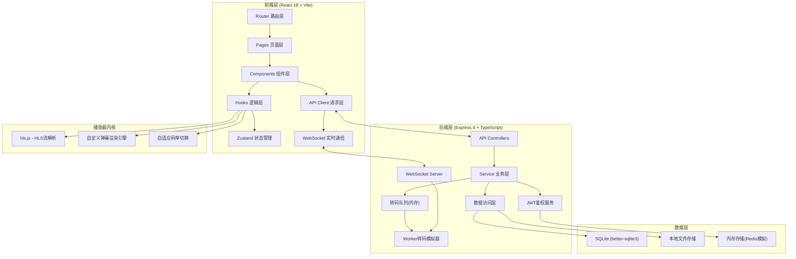
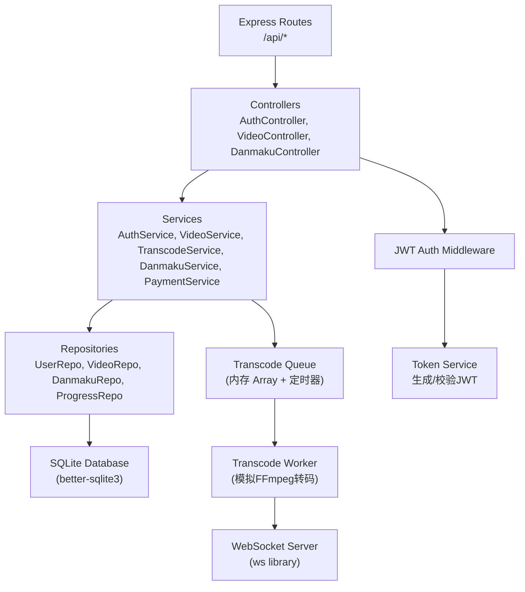
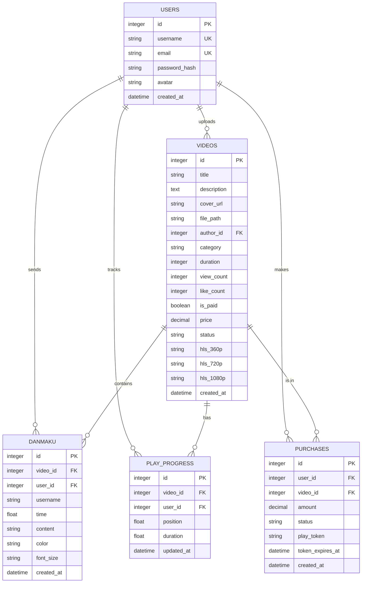

## 1. 架构设计



## 2. 技术描述

- **前端**：React@18 + TypeScript + Vite@5 + TailwindCSS@3 + Zustand@4 + React Router@6 + hls.js@1.5 + lucide-react
- **初始化工具**：vite-init (react-express-ts模板)
- **后端**：Express@4 + TypeScript + better-sqlite3 + ws@8 (WebSocket) + jsonwebtoken
- **数据库**：SQLite（单文件数据库，零配置部署），内存模拟任务队列和缓存
- **实时通信**：原生 WebSocket (ws库)，实现转码进度推送、弹幕实时广播
- **转码方案**：后端模拟FFmpeg转码流程（演示环境），按时间步进更新进度
- **视频播放器**：原生 video 元素 + hls.js 库实现HLS播放和自适应清晰度
- **鉴权方式**：双Token策略 - 用户登录JWT + 视频播放专属Token（带时效和视频ID绑定）

## 3. 路由定义

### 前端路由

| 路由 | 页面组件 | 功能 |
|------|---------|------|
| `/` | HomePage | 首页：视频列表、分类筛选、搜索 |
| `/upload` | UploadPage | 视频上传、转码进度展示 |
| `/video/:id` | VideoPage | 视频播放、弹幕互动、付费验证 |
| `/login` | LoginPage | 用户登录/注册 |

### 后端API路由

| 方法 | 路径 | 功能 |
|------|------|------|
| POST | `/api/auth/register` | 用户注册 |
| POST | `/api/auth/login` | 用户登录，返回accessToken |
| GET | `/api/videos` | 获取视频列表（支持分类/搜索/分页参数） |
| GET | `/api/videos/:id` | 获取视频详情 |
| POST | `/api/videos/upload` | 上传视频文件（multipart/form-data） |
| GET | `/api/videos/:id/play` | 获取播放地址，付费视频校验Token |
| POST | `/api/videos/:id/purchase` | 购买付费视频，生成播放Token |
| GET | `/api/videos/:id/progress` | 获取用户播放进度 |
| POST | `/api/videos/:id/progress` | 保存用户播放进度 |
| GET | `/api/videos/:id/danmaku` | 获取视频弹幕列表 |
| POST | `/api/videos/:id/danmaku` | 发送弹幕 |

## 4. API类型定义

```typescript
// ===== 用户相关 =====
interface User {
  id: number;
  username: string;
  email: string;
  avatar: string;
  createdAt: string;
}

interface LoginRequest {
  username: string;
  password: string;
}

interface AuthResponse {
  user: User;
  accessToken: string;
}

// ===== 视频相关 =====
type VideoStatus = 'uploading' | 'transcoding' | 'ready' | 'error';
type VideoCategory = 'tech' | 'entertainment' | 'education' | 'gaming' | 'music' | 'other';

interface Video {
  id: number;
  title: string;
  description: string;
  coverUrl: string;
  author: User;
  category: VideoCategory;
  duration: number;
  viewCount: number;
  likeCount: number;
  isPaid: boolean;
  price: number;
  status: VideoStatus;
  createdAt: string;
  hlsPlaylists: {
    '360p': string;
    '720p': string;
    '1080p': string;
    auto: string;
  } | null;
}

interface VideoUploadRequest {
  title: string;
  description: string;
  category: VideoCategory;
  isPaid: boolean;
  price: number;
}

interface TranscodeProgress {
  videoId: number;
  stage: 'uploading' | 'analyzing' | 'transcoding_360p' | 'transcoding_720p' | 'transcoding_1080p' | 'packaging' | 'done';
  stageProgress: number;
  overallProgress: number;
  completedResolutions: string[];
  message: string;
}

// ===== 弹幕相关 =====
interface Danmaku {
  id: number;
  videoId: number;
  userId: number;
  username: string;
  time: number;
  content: string;
  color: string;
  fontSize: 'small' | 'medium' | 'large';
  createdAt: string;
}

interface SendDanmakuRequest {
  time: number;
  content: string;
  color: string;
  fontSize: 'small' | 'medium' | 'large';
}

// ===== 播放进度 =====
interface PlayProgress {
  videoId: number;
  userId: number;
  position: number;
  duration: number;
  updatedAt: string;
}

// ===== 付费/鉴权 =====
interface PurchaseRequest {
  videoId: number;
  paymentMethod: 'alipay' | 'wechat' | 'card';
}

interface PlayAuthToken {
  token: string;
  videoId: number;
  expiresAt: number;
}

// ===== WebSocket消息 =====
interface WSMessage {
  type: 'transcode_progress' | 'danmaku_new' | 'purchase_success';
  payload: TranscodeProgress | Danmaku | PlayAuthToken;
}
```

## 5. 后端架构分层



## 6. 数据模型

### 6.1 ER图



### 6.2 DDL语句

```sql
-- 用户表
CREATE TABLE IF NOT EXISTS users (
  id INTEGER PRIMARY KEY AUTOINCREMENT,
  username TEXT UNIQUE NOT NULL,
  email TEXT UNIQUE NOT NULL,
  password_hash TEXT NOT NULL,
  avatar TEXT DEFAULT '',
  created_at DATETIME DEFAULT CURRENT_TIMESTAMP
);

-- 视频表
CREATE TABLE IF NOT EXISTS videos (
  id INTEGER PRIMARY KEY AUTOINCREMENT,
  title TEXT NOT NULL,
  description TEXT DEFAULT '',
  cover_url TEXT DEFAULT '',
  file_path TEXT DEFAULT '',
  author_id INTEGER NOT NULL,
  category TEXT DEFAULT 'other',
  duration INTEGER DEFAULT 0,
  view_count INTEGER DEFAULT 0,
  like_count INTEGER DEFAULT 0,
  is_paid INTEGER DEFAULT 0,
  price REAL DEFAULT 0,
  status TEXT DEFAULT 'uploading',
  hls_360p TEXT DEFAULT '',
  hls_720p TEXT DEFAULT '',
  hls_1080p TEXT DEFAULT '',
  created_at DATETIME DEFAULT CURRENT_TIMESTAMP,
  FOREIGN KEY (author_id) REFERENCES users(id)
);

-- 弹幕表
CREATE TABLE IF NOT EXISTS danmaku (
  id INTEGER PRIMARY KEY AUTOINCREMENT,
  video_id INTEGER NOT NULL,
  user_id INTEGER NOT NULL,
  username TEXT NOT NULL,
  time REAL NOT NULL,
  content TEXT NOT NULL,
  color TEXT DEFAULT '#FFFFFF',
  font_size TEXT DEFAULT 'medium',
  created_at DATETIME DEFAULT CURRENT_TIMESTAMP,
  FOREIGN KEY (video_id) REFERENCES videos(id),
  FOREIGN KEY (user_id) REFERENCES users(id)
);
CREATE INDEX IF NOT EXISTS idx_danmaku_video_time ON danmaku(video_id, time);

-- 播放进度表
CREATE TABLE IF NOT EXISTS play_progress (
  id INTEGER PRIMARY KEY AUTOINCREMENT,
  video_id INTEGER NOT NULL,
  user_id INTEGER NOT NULL,
  position REAL DEFAULT 0,
  duration REAL DEFAULT 0,
  updated_at DATETIME DEFAULT CURRENT_TIMESTAMP,
  UNIQUE(video_id, user_id),
  FOREIGN KEY (video_id) REFERENCES videos(id),
  FOREIGN KEY (user_id) REFERENCES users(id)
);

-- 购买记录表
CREATE TABLE IF NOT EXISTS purchases (
  id INTEGER PRIMARY KEY AUTOINCREMENT,
  user_id INTEGER NOT NULL,
  video_id INTEGER NOT NULL,
  amount REAL NOT NULL,
  status TEXT DEFAULT 'pending',
  play_token TEXT DEFAULT '',
  token_expires_at DATETIME,
  created_at DATETIME DEFAULT CURRENT_TIMESTAMP,
  FOREIGN KEY (user_id) REFERENCES users(id),
  FOREIGN KEY (video_id) REFERENCES videos(id)
);
CREATE INDEX IF NOT EXISTS idx_purchases_token ON purchases(play_token);

-- 初始测试用户 (密码: demo123)
INSERT OR IGNORE INTO users (id, username, email, password_hash, avatar) VALUES
(1, 'demo_user', 'demo@example.com', '$2b$10$N9qo8uLOickgx2ZMRZoMye.IjzZQ2OoxxG5W5YkqB3xG2qO0yMq/i', '');
```

## 7. 项目目录结构

```
├── api/                           # 后端 Express 代码
│   ├── src/
│   │   ├── index.ts              # 服务器入口 (Express + WebSocket)
│   │   ├── database.ts           # SQLite 初始化连接
│   │   ├── middleware/
│   │   │   └── auth.ts           # JWT 鉴权中间件
│   │   ├── controllers/
│   │   │   ├── auth.controller.ts
│   │   │   ├── video.controller.ts
│   │   │   └── danmaku.controller.ts
│   │   ├── services/
│   │   │   ├── auth.service.ts
│   │   │   ├── video.service.ts
│   │   │   ├── transcode.service.ts    # 转码队列与Worker
│   │   │   ├── danmaku.service.ts
│   │   │   └── payment.service.ts      # 支付与Token生成
│   │   ├── repositories/
│   │   │   ├── user.repo.ts
│   │   │   ├── video.repo.ts
│   │   │   ├── danmaku.repo.ts
│   │   │   └── progress.repo.ts
│   │   └── shared/
│   │       └── types.ts          # 共享类型定义
│   └── data/
│       └── app.db                # SQLite数据库文件(运行时生成)
├── src/                           # 前端 React 代码
│   ├── main.tsx
│   ├── App.tsx                   # 路由配置
│   ├── index.css                 # Tailwind 全局样式与主题
│   ├── pages/
│   │   ├── HomePage.tsx
│   │   ├── UploadPage.tsx
│   │   ├── VideoPage.tsx
│   │   └── LoginPage.tsx
│   ├── components/
│   │   ├── layout/
│   │   │   ├── Navbar.tsx
│   │   │   ├── Footer.tsx
│   │   │   └── VideoCard.tsx
│   │   ├── player/
│   │   │   ├── VideoPlayer.tsx       # 主播放器容器
│   │   │   ├── PlayerControls.tsx    # 播放控制栏
│   │   │   ├── DanmakuLayer.tsx      # 弹幕渲染层
│   │   │   ├── DanmakuInput.tsx      # 弹幕发送输入
│   │   │   └── PaywallModal.tsx      # 付费拦截弹窗
│   │   └── upload/
│   │       ├── DropZone.tsx
│   │       ├── UploadForm.tsx
│   │       └── ProgressTracker.tsx   # 转码进度组件
│   ├── hooks/
│   │   ├── useWebSocket.ts           # WebSocket连接Hook
│   │   ├── useHlsPlayer.ts           # HLS播放控制Hook
│   │   ├── useDanmakuEngine.ts       # 弹幕引擎Hook
│   │   └── useAuth.ts                # 用户鉴权Hook
│   ├── store/
│   │   ├── useAuthStore.ts
│   │   └── usePlayerStore.ts
│   ├── api/
│   │   ├── client.ts                 # Axios实例
│   │   ├── auth.api.ts
│   │   ├── video.api.ts
│   │   └── danmaku.api.ts
│   └── utils/
│       ├── format.ts                 # 时间/数字格式化
│       └── token.ts                  # Token存储工具
├── shared/                           # 前后端共享类型
│   └── types.ts
├── vite.config.ts
├── tailwind.config.js
└── tsconfig.json
```
